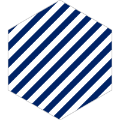
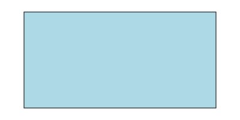
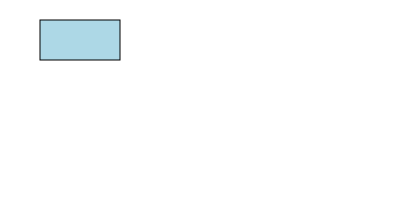

<!-- README.md is generated from README.Rmd. Please edit that file -->

# svganim 

<!-- badges: start -->


<!-- badges: end -->

`svganim` provides some simple parameterised animations (created using
`minisvg`) to apply to svg objects.

Because github sanitises SVG to remove some elements of style, scripting
and animation, please see the [svganim pkgdown
website](https://coolbutuseless.github.io/package/svganim/index.html) to
view the animations.

This package is meant to be a *quick start* to getting animations into
your SVG. To really get most out of SVG animations, you’ll have to read
the SVG docs and start creating your own\!

The following animations are provided in this package:

  - Rotate an SVG element - `create_anim_rotation()`
  - Rotate an SVG pattern - `create_anim_pattern_rotation()`
  - Pulse the width of a line - `create_anim_pulse_line()`
  - Move an object along a path (given by a sequence of x, y
    coordinates) - `create_anim_motion()`
  - Animate the rendering of an objects outline -
    `create_anim_stroke_render()`

## Installation

You can install from [GitHub](https://github.com/coolbutuseless/svganim)
with:

``` r
# install.packages("devtools")
devtools::install_github("coolbutuseless/minisvg")   # Build SVG documents with R
devtools::install_github("coolbutuseless/svganim")   # This package
```

## Create a pattern animation - `create_anim_pattern_rotation()`

``` r
#~~~~~~~~~~~~~~~~~~~~~~~~~~~~~~~~~~~~~~~~~~~~~~~~~~~~~~~~~~~~~~~~~~~~~~~~~~~~~
# Create a simple pattern using the `svgpatternsimple` package
#~~~~~~~~~~~~~~~~~~~~~~~~~~~~~~~~~~~~~~~~~~~~~~~~~~~~~~~~~~~~~~~~~~~~~~~~~~~~~
stripes <- svgpatternsimple::create_pattern_stripe(id = 'stripe')

#~~~~~~~~~~~~~~~~~~~~~~~~~~~~~~~~~~~~~~~~~~~~~~~~~~~~~~~~~~~~~~~~~~~~~~~~~~~~~
# Create a pattern rotation animation and add it to the pattern
#~~~~~~~~~~~~~~~~~~~~~~~~~~~~~~~~~~~~~~~~~~~~~~~~~~~~~~~~~~~~~~~~~~~~~~~~~~~~~
anim1 <- create_anim_pattern_rotation()
stripes$append(anim1)
```

<pre><details><summary style='color: #4169E1;'> Show/hide SVG text </summary>&lt;pattern id="stripe" width="20" height="20" patternTransform="rotate(45 0 0)" patternUnits="userSpaceOnUse"&gt;
  &lt;rect width="100%" height="100%" style="fill:#ffffff; fill-opacity:1; stroke:none;" /&gt;
  &lt;line x1="0" y1="0" x2="0" y2="20" style="stroke:#000000; stroke-width:8; stroke-opacity:1;" /&gt;
  &lt;animateTransform attributeName="patternTransform" attributeType="xml" from="0 0 0" to="360 0 0" type="rotate" dur="16s" repeatCount="indefinite" /&gt;
&lt;/pattern&gt;</details></pre>


## Animate the pulsing of an object’s outline - `create_anim_pulse_line()`

``` r
#~~~~~~~~~~~~~~~~~~~~~~~~~~~~~~~~~~~~~~~~~~~~~~~~~~~~~~~~~~~~~~~~~~~~~~~~~~~~~
# Create a document in `minisvg`
#~~~~~~~~~~~~~~~~~~~~~~~~~~~~~~~~~~~~~~~~~~~~~~~~~~~~~~~~~~~~~~~~~~~~~~~~~~~~~
library(minisvg)
doc   <- minisvg::svg_doc(width = 400, height = 200)

#~~~~~~~~~~~~~~~~~~~~~~~~~~~~~~~~~~~~~~~~~~~~~~~~~~~~~~~~~~~~~~~~~~~~~~~~~~~~~
# Create the pulse animation
#~~~~~~~~~~~~~~~~~~~~~~~~~~~~~~~~~~~~~~~~~~~~~~~~~~~~~~~~~~~~~~~~~~~~~~~~~~~~~
pulse <- create_anim_pulse_line(size2 = 20)

#~~~~~~~~~~~~~~~~~~~~~~~~~~~~~~~~~~~~~~~~~~~~~~~~~~~~~~~~~~~~~~~~~~~~~~~~~~~~~
# Create a rectangle which includes the animation
#~~~~~~~~~~~~~~~~~~~~~~~~~~~~~~~~~~~~~~~~~~~~~~~~~~~~~~~~~~~~~~~~~~~~~~~~~~~~~
rect  <- stag$rect(
  x = "10%", y = "10%", width = "80%", height = "80%",
  fill = "lightblue", stroke = 'black',
  pulse
)

#~~~~~~~~~~~~~~~~~~~~~~~~~~~~~~~~~~~~~~~~~~~~~~~~~~~~~~~~~~~~~~~~~~~~~~~~~~~~~
# Add the animated rectangle to the svg document and save
#~~~~~~~~~~~~~~~~~~~~~~~~~~~~~~~~~~~~~~~~~~~~~~~~~~~~~~~~~~~~~~~~~~~~~~~~~~~~~
doc$append(rect)
# doc$show()
doc$save("man/figures/README-example-pulse.svg")
```

<pre><details><summary style='color: #4169E1;'> Show/hide SVG text </summary>&lt;?xml version="1.0" encoding="UTF-8"?&gt;
&lt;svg width="400" height="200" viewBox="0 0 400 200" xmlns="http://www.w3.org/2000/svg" xmlns:xlink="http://www.w3.org/1999/xlink"&gt;
  &lt;rect x="10%" y="10%" width="80%" height="80%" fill="lightblue" stroke="black"&gt;
    &lt;animate attributeName="stroke-width" attributeType="XML" dur="4s" repeatCount="indefinite" values="0;20;0" keyTimes="0;0.5;1" /&gt;
  &lt;/rect&gt;
&lt;/svg&gt;</details></pre>



## Animate the rendering of an object’s outline - `create_anim_stroke_render()`

``` r
#~~~~~~~~~~~~~~~~~~~~~~~~~~~~~~~~~~~~~~~~~~~~~~~~~~~~~~~~~~~~~~~~~~~~~~~~~~~~~
# Create a document in `minisvg`
#~~~~~~~~~~~~~~~~~~~~~~~~~~~~~~~~~~~~~~~~~~~~~~~~~~~~~~~~~~~~~~~~~~~~~~~~~~~~~
library(minisvg)
doc   <- minisvg::svg_doc(width = 400, height = 200)

#~~~~~~~~~~~~~~~~~~~~~~~~~~~~~~~~~~~~~~~~~~~~~~~~~~~~~~~~~~~~~~~~~~~~~~~~~~~~~
# Create the pulse animation
#~~~~~~~~~~~~~~~~~~~~~~~~~~~~~~~~~~~~~~~~~~~~~~~~~~~~~~~~~~~~~~~~~~~~~~~~~~~~~
stroke_render <- create_anim_stroke_render(size2 = 20)

#~~~~~~~~~~~~~~~~~~~~~~~~~~~~~~~~~~~~~~~~~~~~~~~~~~~~~~~~~~~~~~~~~~~~~~~~~~~~~
# Create a rectangle which includes the animation
#~~~~~~~~~~~~~~~~~~~~~~~~~~~~~~~~~~~~~~~~~~~~~~~~~~~~~~~~~~~~~~~~~~~~~~~~~~~~~
rect  <- stag$rect(
  x = "10%", y = "10%", width = "80%", height = "80%",
  fill = "lightblue", stroke = 'black',
  stroke_dasharray = 2000,
  stroke_render
)

#~~~~~~~~~~~~~~~~~~~~~~~~~~~~~~~~~~~~~~~~~~~~~~~~~~~~~~~~~~~~~~~~~~~~~~~~~~~~~
# Add the animated rectangle to the svg document and save
#~~~~~~~~~~~~~~~~~~~~~~~~~~~~~~~~~~~~~~~~~~~~~~~~~~~~~~~~~~~~~~~~~~~~~~~~~~~~~
doc$append(rect)
# doc$show()
doc$save("man/figures/README-example-stroke-render.svg")
```

<pre><details><summary style='color: #4169E1;'> Show/hide SVG text </summary>&lt;?xml version="1.0" encoding="UTF-8"?&gt;
&lt;svg width="400" height="200" viewBox="0 0 400 200" xmlns="http://www.w3.org/2000/svg" xmlns:xlink="http://www.w3.org/1999/xlink"&gt;
  &lt;rect x="10%" y="10%" width="80%" height="80%" fill="lightblue" stroke="black" stroke-dasharray="2000"&gt;
    &lt;animate attributeName="stroke-dashoffset" attributeType="XML" dur="4s" repeatCount="indefinite" values="2000;0" keyTimes="0;1" size2="20" /&gt;
  &lt;/rect&gt;
&lt;/svg&gt;</details></pre>


## Animate the rotation of an object - `create_anim_rotation()`

``` r
#~~~~~~~~~~~~~~~~~~~~~~~~~~~~~~~~~~~~~~~~~~~~~~~~~~~~~~~~~~~~~~~~~~~~~~~~~~~~~
# Create a document in `minisvg`
#~~~~~~~~~~~~~~~~~~~~~~~~~~~~~~~~~~~~~~~~~~~~~~~~~~~~~~~~~~~~~~~~~~~~~~~~~~~~~
library(minisvg)
doc   <- minisvg::svg_doc(width = 400, height = 200)

#~~~~~~~~~~~~~~~~~~~~~~~~~~~~~~~~~~~~~~~~~~~~~~~~~~~~~~~~~~~~~~~~~~~~~~~~~~~~~
# Create the rotation animation around a particular point
#~~~~~~~~~~~~~~~~~~~~~~~~~~~~~~~~~~~~~~~~~~~~~~~~~~~~~~~~~~~~~~~~~~~~~~~~~~~~~
rotation <- create_anim_rotation(cx = 200, cy = 100)

#~~~~~~~~~~~~~~~~~~~~~~~~~~~~~~~~~~~~~~~~~~~~~~~~~~~~~~~~~~~~~~~~~~~~~~~~~~~~~
# Create a rectangle which includes the animation
#~~~~~~~~~~~~~~~~~~~~~~~~~~~~~~~~~~~~~~~~~~~~~~~~~~~~~~~~~~~~~~~~~~~~~~~~~~~~~
rect  <- stag$rect(
  x = "10%", y = "10%", width = "80%", height = "80%",
  fill = "lightblue", stroke = 'black',
  rotation
)

#~~~~~~~~~~~~~~~~~~~~~~~~~~~~~~~~~~~~~~~~~~~~~~~~~~~~~~~~~~~~~~~~~~~~~~~~~~~~~
# Add the animated rectangle to the svg document and save
#~~~~~~~~~~~~~~~~~~~~~~~~~~~~~~~~~~~~~~~~~~~~~~~~~~~~~~~~~~~~~~~~~~~~~~~~~~~~~
doc$append(rect)
# doc$show()
doc$save("man/figures/README-example-rotation.svg")
```

<pre><details><summary style='color: #4169E1;'> Show/hide SVG text </summary>&lt;?xml version="1.0" encoding="UTF-8"?&gt;
&lt;svg width="400" height="200" viewBox="0 0 400 200" xmlns="http://www.w3.org/2000/svg" xmlns:xlink="http://www.w3.org/1999/xlink"&gt;
  &lt;rect x="10%" y="10%" width="80%" height="80%" fill="lightblue" stroke="black"&gt;
    &lt;animateTransform attributeName="transform" attributeType="xml" from="0 200 100" to="360 200 100" type="rotate" dur="16s" repeatCount="indefinite" /&gt;
  &lt;/rect&gt;
&lt;/svg&gt;</details></pre>


## Apply multiple animations to an object

In this example, the pulse of the line width is done in conjunction with
moving the rectangle along a path.

``` r
#~~~~~~~~~~~~~~~~~~~~~~~~~~~~~~~~~~~~~~~~~~~~~~~~~~~~~~~~~~~~~~~~~~~~~~~~~~~~~
# Create a document in `minisvg`
#~~~~~~~~~~~~~~~~~~~~~~~~~~~~~~~~~~~~~~~~~~~~~~~~~~~~~~~~~~~~~~~~~~~~~~~~~~~~~
library(minisvg)
doc   <- minisvg::svg_doc(width = 400, height = 200)

#~~~~~~~~~~~~~~~~~~~~~~~~~~~~~~~~~~~~~~~~~~~~~~~~~~~~~~~~~~~~~~~~~~~~~~~~~~~~~
# Create the motion animated along the path given by xs, ys
#~~~~~~~~~~~~~~~~~~~~~~~~~~~~~~~~~~~~~~~~~~~~~~~~~~~~~~~~~~~~~~~~~~~~~~~~~~~~~
path_motion <- create_anim_motion(xs = c(20, 180, 180, 20), ys = c(20, 20, 80, 80))

#~~~~~~~~~~~~~~~~~~~~~~~~~~~~~~~~~~~~~~~~~~~~~~~~~~~~~~~~~~~~~~~~~~~~~~~~~~~~~
# Create a rectangle which includes multiple animations
#~~~~~~~~~~~~~~~~~~~~~~~~~~~~~~~~~~~~~~~~~~~~~~~~~~~~~~~~~~~~~~~~~~~~~~~~~~~~~
rect  <- stag$rect(
  x = "10%", y = "10%", width = "20%", height = "20%",
  fill = "lightblue", stroke = 'black',
  path_motion, 
  pulse
)

#~~~~~~~~~~~~~~~~~~~~~~~~~~~~~~~~~~~~~~~~~~~~~~~~~~~~~~~~~~~~~~~~~~~~~~~~~~~~~
# Add the animated rectangle to the svg document and save
#~~~~~~~~~~~~~~~~~~~~~~~~~~~~~~~~~~~~~~~~~~~~~~~~~~~~~~~~~~~~~~~~~~~~~~~~~~~~~
doc$append(rect)
# doc$show()
doc$save("man/figures/README-example-pathmotion.svg")
```

<pre><details><summary style='color: #4169E1;'> Show/hide SVG text </summary>&lt;?xml version="1.0" encoding="UTF-8"?&gt;
&lt;svg width="400" height="200" viewBox="0 0 400 200" xmlns="http://www.w3.org/2000/svg" xmlns:xlink="http://www.w3.org/1999/xlink"&gt;
  &lt;rect x="10%" y="10%" width="20%" height="20%" fill="lightblue" stroke="black"&gt;
    &lt;animateMotion path="M 20 20 L 180 20 L 180 80 L 20 80 Z" dur="4s" repeatCount="indefinite" /&gt;
    &lt;animate attributeName="stroke-width" attributeType="XML" dur="4s" repeatCount="indefinite" values="0;20;0" keyTimes="0;0.5;1" /&gt;
  &lt;/rect&gt;
&lt;/svg&gt;</details></pre>



## Creating the logo for this package

``` r
#~~~~~~~~~~~~~~~~~~~~~~~~~~~~~~~~~~~~~~~~~~~~~~~~~~~~~~~~~~~~~~~~~~~~~~~~~~~~~
# Building an SVG logo with an animated stripe
#~~~~~~~~~~~~~~~~~~~~~~~~~~~~~~~~~~~~~~~~~~~~~~~~~~~~~~~~~~~~~~~~~~~~~~~~~~~~~
logo <- svg_doc(width = 200, height = 200)

#~~~~~~~~~~~~~~~~~~~~~~~~~~~~~~~~~~~~~~~~~~~~~~~~~~~~~~~~~~~~~~~~~~~~~~~~~~~~~
# Create a simple pattern using the `svgpatternsimple` package
#~~~~~~~~~~~~~~~~~~~~~~~~~~~~~~~~~~~~~~~~~~~~~~~~~~~~~~~~~~~~~~~~~~~~~~~~~~~~~
stripes <- svgpatternsimple::create_pattern_stripe(id = 'stripe', colour = '#002366', fill_fraction = 0.5)

#~~~~~~~~~~~~~~~~~~~~~~~~~~~~~~~~~~~~~~~~~~~~~~~~~~~~~~~~~~~~~~~~~~~~~~~~~~~~~
# Create a pattern rotation animation and add it to the pattern
#~~~~~~~~~~~~~~~~~~~~~~~~~~~~~~~~~~~~~~~~~~~~~~~~~~~~~~~~~~~~~~~~~~~~~~~~~~~~~
anim1 <- create_anim_pattern_rotation(duration = 30)
stripes$append(anim1)

#~~~~~~~~~~~~~~~~~~~~~~~~~~~~~~~~~~~~~~~~~~~~~~~~~~~~~~~~~~~~~~~~~~~~~~~~~~~~~
# Add the pattern to the documents list of definitions
#~~~~~~~~~~~~~~~~~~~~~~~~~~~~~~~~~~~~~~~~~~~~~~~~~~~~~~~~~~~~~~~~~~~~~~~~~~~~~
logo$defs(stripes)

#~~~~~~~~~~~~~~~~~~~~~~~~~~~~~~~~~~~~~~~~~~~~~~~~~~~~~~~~~~~~~~~~~~~~~~~~~~~~~
# Create a hexagon filled with this pattern, and add it to the document
#~~~~~~~~~~~~~~~~~~~~~~~~~~~~~~~~~~~~~~~~~~~~~~~~~~~~~~~~~~~~~~~~~~~~~~~~~~~~~
len     <- 100
angles  <- (seq(0, 360, 60) + 90) * pi/180
xs      <- round(len * cos(angles) + 100, 2)
ys      <- round(len * sin(angles) + 100, 2)
hex     <- stag$polygon(id = 'hex', xs = xs, ys = ys)
hex$update(stroke = '#c0c0c0', fill = stripes)
logo$append(hex)

#~~~~~~~~~~~~~~~~~~~~~~~~~~~~~~~~~~~~~~~~~~~~~~~~~~~~~~~~~~~~~~~~~~~~~~~~~~~~~
# output
#~~~~~~~~~~~~~~~~~~~~~~~~~~~~~~~~~~~~~~~~~~~~~~~~~~~~~~~~~~~~~~~~~~~~~~~~~~~~~
# logo$show()
logo$save("man/figures/logo.svg")
```

<pre><details open><summary style='color: #4169E1;'> Show/hide SVG text </summary>&lt;?xml version="1.0" encoding="UTF-8"?&gt;
&lt;svg width="200" height="200" viewBox="0 0 200 200" xmlns="http://www.w3.org/2000/svg" xmlns:xlink="http://www.w3.org/1999/xlink"&gt;
  &lt;defs&gt;
    &lt;pattern id="stripe" width="20" height="20" patternTransform="rotate(45 0 0)" patternUnits="userSpaceOnUse"&gt;
      &lt;rect width="100%" height="100%" style="fill:#ffffff; fill-opacity:1; stroke:none;" /&gt;
      &lt;line x1="0" y1="0" x2="0" y2="20" style="stroke:#002366; stroke-width:20; stroke-opacity:1;" /&gt;
      &lt;animateTransform attributeName="patternTransform" attributeType="xml" from="0 0 0" to="360 0 0" type="rotate" dur="30s" repeatCount="indefinite" /&gt;
    &lt;/pattern&gt;
  &lt;/defs&gt;
  &lt;polygon points="100,200 13.4,150 13.4,50 100,0 186.6,50 186.6,150 100,200" id="hex" stroke="#c0c0c0" fill="url('#stripe')" /&gt;
&lt;/svg&gt;</details></pre>


