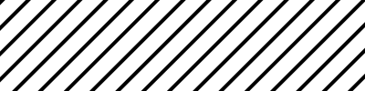
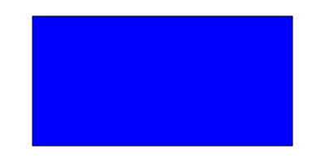
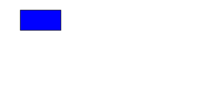

```{r, include = FALSE}
knitr::opts_chunk$set(
  collapse = TRUE,
  comment = "#>"
)
```

```{r setup}
library(minisvg)
library(svganim)
```


Introduction
==============================================================================

There are at least 5 methods of animating SVG. These methods are detailed on the [w3.org pages](https://www.w3.org/TR/SVG/animate.html)).

The 5 methods are as follows:

1. SMIL - Synchronized Multimedia Integration Language.  [MDN doc](https://developer.mozilla.org/en-US/docs/Web/SVG/SVG_animation_with_SMIL)
2. CSS Animations [w3 css animation reference](https://www.w3.org/TR/css-animations-1/)
3. CSS Transitions [w3 css transitions reference](https://www.w3.org/TR/css-transitions-1/)
4. SVG DOM manipulation via scripting  [w3 reference](https://www.w3.org/TR/SVG/types.html#SVGDOMOverview)
5. Web Animation [w3 web animation reference](https://www.w3.org/TR/web-animations-1/)

This package (and this vignette) uses SMIL to animate the SVG by including animation specific tags
witin objects.

This vignette assumes you are familiar with SVG tags and document structures.


SMIL animation
==============================================================================

SMIL stands for [Synchronized Multimedia Integration Language](http://www.w3.org/TR/REC-smil).

The way it works is to add an `animate`, `animateTransform` or `animateMotion` tag
as a child of the element to be animated.

* `<animate />` - specifies an attribute on the parent object and how it should change. e.g.
   change the radius of a `<circle />` element.
* `<animateTransform />` - specifies how the transformation of the parent object should
   change e.g. change the rotation of the object from 0 to 90 degrees.
* `<animationMotion />` - species how the object moves along a given path.


This package includes a number of pre-baked animation types, and this
vignette shows examples of how these animations can 
be applied to elements.


## Create a pattern animation

```{r}
#~~~~~~~~~~~~~~~~~~~~~~~~~~~~~~~~~~~~~~~~~~~~~~~~~~~~~~~~~~~~~~~~~~~~~~~~~~~~~
# Create a simple pattern using the `svgpatternsimple` package
#~~~~~~~~~~~~~~~~~~~~~~~~~~~~~~~~~~~~~~~~~~~~~~~~~~~~~~~~~~~~~~~~~~~~~~~~~~~~~
stripes <- svgpatternsimple::create_pattern_stripe(id = 'stripe')

#~~~~~~~~~~~~~~~~~~~~~~~~~~~~~~~~~~~~~~~~~~~~~~~~~~~~~~~~~~~~~~~~~~~~~~~~~~~~~
# Create a pattern rotation animation and add it to the pattern
#~~~~~~~~~~~~~~~~~~~~~~~~~~~~~~~~~~~~~~~~~~~~~~~~~~~~~~~~~~~~~~~~~~~~~~~~~~~~~
anim1 <- create_anim_pattern_rotation()
stripes$append(anim1)

stripes$save_full_svg("svg/README-stripe-rotation.svg", height = 100)
```


```{r echo=FALSE, results='asis'}
cat(
  "<pre>",
  "<details><summary style='color: #4169E1;'> Show/hide SVG text </summary>",
  htmltools::htmlEscape(as.character(stripes)),
  "</details>",
  "</pre>", sep='')
```


```{r echo = FALSE}
if (interactive()) {
  stripes$show()
} 
```




## Animate the pulsing of an object's outline

```{r}
#~~~~~~~~~~~~~~~~~~~~~~~~~~~~~~~~~~~~~~~~~~~~~~~~~~~~~~~~~~~~~~~~~~~~~~~~~~~~~
# Create a document in `minisvg`
#~~~~~~~~~~~~~~~~~~~~~~~~~~~~~~~~~~~~~~~~~~~~~~~~~~~~~~~~~~~~~~~~~~~~~~~~~~~~~
library(minisvg)
doc   <- minisvg::svg_doc(width = 400, height = 200)

#~~~~~~~~~~~~~~~~~~~~~~~~~~~~~~~~~~~~~~~~~~~~~~~~~~~~~~~~~~~~~~~~~~~~~~~~~~~~~
# Create the pulse animation
#~~~~~~~~~~~~~~~~~~~~~~~~~~~~~~~~~~~~~~~~~~~~~~~~~~~~~~~~~~~~~~~~~~~~~~~~~~~~~
pulse <- create_anim_pulse_line(size2 = 20)

#~~~~~~~~~~~~~~~~~~~~~~~~~~~~~~~~~~~~~~~~~~~~~~~~~~~~~~~~~~~~~~~~~~~~~~~~~~~~~
# Create a rectangle which includes the animation
#~~~~~~~~~~~~~~~~~~~~~~~~~~~~~~~~~~~~~~~~~~~~~~~~~~~~~~~~~~~~~~~~~~~~~~~~~~~~~
rect  <- stag$rect(
  x = "10%", y = "10%", width = "80%", height = "80%",
  fill = "blue", stroke = 'black',
  pulse
)

#~~~~~~~~~~~~~~~~~~~~~~~~~~~~~~~~~~~~~~~~~~~~~~~~~~~~~~~~~~~~~~~~~~~~~~~~~~~~~
# Add the animated rectangle to the svg document and save
#~~~~~~~~~~~~~~~~~~~~~~~~~~~~~~~~~~~~~~~~~~~~~~~~~~~~~~~~~~~~~~~~~~~~~~~~~~~~~
doc$append(rect)
# doc$show()
doc$save("svg/README-example-pulse.svg")
```


```{r echo=FALSE, results='asis'}
cat(
  "<pre>",
  "<details><summary style='color: #4169E1;'> Show/hide SVG text </summary>",
  htmltools::htmlEscape(as.character(doc)),
  "</details>",
  "</pre>", sep='')
```


## Animate the rotation of an object

```{r eval=TRUE}
#~~~~~~~~~~~~~~~~~~~~~~~~~~~~~~~~~~~~~~~~~~~~~~~~~~~~~~~~~~~~~~~~~~~~~~~~~~~~~
# Create a document in `minisvg`
#~~~~~~~~~~~~~~~~~~~~~~~~~~~~~~~~~~~~~~~~~~~~~~~~~~~~~~~~~~~~~~~~~~~~~~~~~~~~~
library(minisvg)
doc   <- minisvg::svg_doc(width = 400, height = 200)

#~~~~~~~~~~~~~~~~~~~~~~~~~~~~~~~~~~~~~~~~~~~~~~~~~~~~~~~~~~~~~~~~~~~~~~~~~~~~~
# Create the rotation animation around a particular point
#~~~~~~~~~~~~~~~~~~~~~~~~~~~~~~~~~~~~~~~~~~~~~~~~~~~~~~~~~~~~~~~~~~~~~~~~~~~~~
rotation <- create_anim_rotation(cx = 200, cy = 100)

#~~~~~~~~~~~~~~~~~~~~~~~~~~~~~~~~~~~~~~~~~~~~~~~~~~~~~~~~~~~~~~~~~~~~~~~~~~~~~
# Create a rectangle which includes the animation
#~~~~~~~~~~~~~~~~~~~~~~~~~~~~~~~~~~~~~~~~~~~~~~~~~~~~~~~~~~~~~~~~~~~~~~~~~~~~~
rect  <- stag$rect(
  x = "10%", y = "10%", width = "80%", height = "80%",
  fill = "blue", stroke = 'black',
  rotation
)

#~~~~~~~~~~~~~~~~~~~~~~~~~~~~~~~~~~~~~~~~~~~~~~~~~~~~~~~~~~~~~~~~~~~~~~~~~~~~~
# Add the animated rectangle to the svg document and save
#~~~~~~~~~~~~~~~~~~~~~~~~~~~~~~~~~~~~~~~~~~~~~~~~~~~~~~~~~~~~~~~~~~~~~~~~~~~~~
doc$append(rect)
# doc$show()
doc$save("svg/README-example-rotation.svg")
```


```{r echo=FALSE, results='asis'}
cat(
  "<pre>",
  "<details><summary style='color: #4169E1;'> Show/hide SVG text </summary>",
  htmltools::htmlEscape(as.character(doc)),
  "</details>",
  "</pre>", sep='')
```





## Anply multiple animations to an object

```{r}
#~~~~~~~~~~~~~~~~~~~~~~~~~~~~~~~~~~~~~~~~~~~~~~~~~~~~~~~~~~~~~~~~~~~~~~~~~~~~~
# Create a document in `minisvg`
#~~~~~~~~~~~~~~~~~~~~~~~~~~~~~~~~~~~~~~~~~~~~~~~~~~~~~~~~~~~~~~~~~~~~~~~~~~~~~
library(minisvg)
doc   <- minisvg::svg_doc(width = 400, height = 200)

#~~~~~~~~~~~~~~~~~~~~~~~~~~~~~~~~~~~~~~~~~~~~~~~~~~~~~~~~~~~~~~~~~~~~~~~~~~~~~
# Create the motion animated along the path given by xs, ys
#~~~~~~~~~~~~~~~~~~~~~~~~~~~~~~~~~~~~~~~~~~~~~~~~~~~~~~~~~~~~~~~~~~~~~~~~~~~~~
path_motion <- create_anim_motion(xs = c(20, 180, 180, 20), ys = c(20, 20, 80, 80))

#~~~~~~~~~~~~~~~~~~~~~~~~~~~~~~~~~~~~~~~~~~~~~~~~~~~~~~~~~~~~~~~~~~~~~~~~~~~~~
# Create a rectangle which includes multiple animations
#~~~~~~~~~~~~~~~~~~~~~~~~~~~~~~~~~~~~~~~~~~~~~~~~~~~~~~~~~~~~~~~~~~~~~~~~~~~~~
rect  <- stag$rect(
  x = "10%", y = "10%", width = "20%", height = "20%",
  fill = "blue", stroke = 'black',
  path_motion, 
  pulse
)

#~~~~~~~~~~~~~~~~~~~~~~~~~~~~~~~~~~~~~~~~~~~~~~~~~~~~~~~~~~~~~~~~~~~~~~~~~~~~~
# Add the animated rectangle to the svg document and save
#~~~~~~~~~~~~~~~~~~~~~~~~~~~~~~~~~~~~~~~~~~~~~~~~~~~~~~~~~~~~~~~~~~~~~~~~~~~~~
doc$append(rect)
# doc$show()
doc$save("svg/README-example-pathmotion.svg")
```


```{r echo=FALSE, results='asis'}
cat(
  "<pre>",
  "<details><summary style='color: #4169E1;'> Show/hide SVG text </summary>",
  htmltools::htmlEscape(as.character(doc)),
  "</details>",
  "</pre>", sep='')
```





